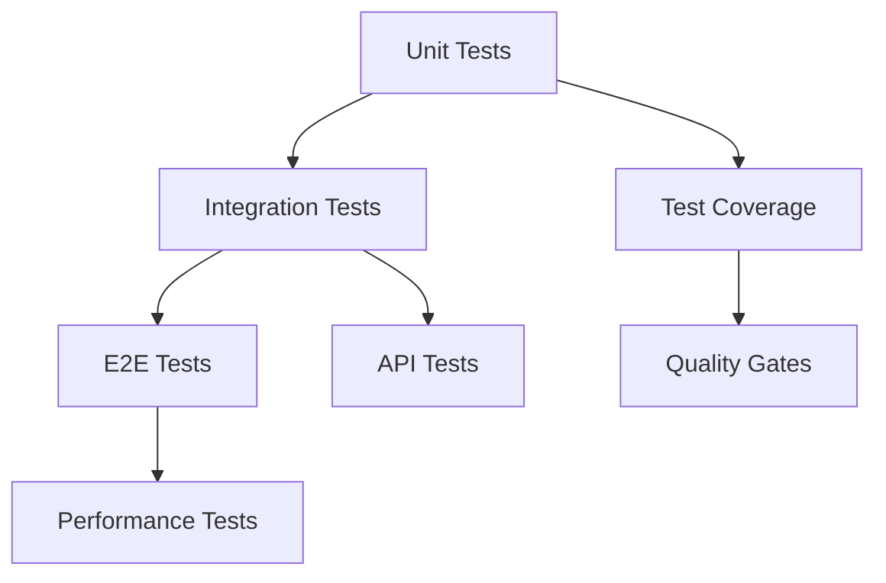
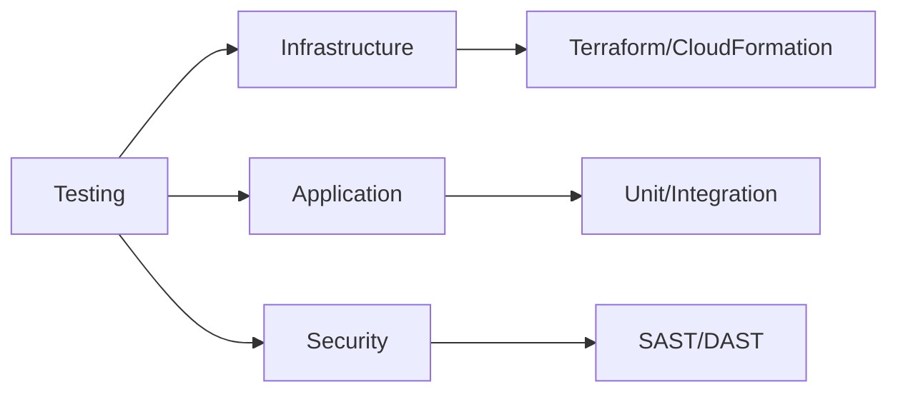
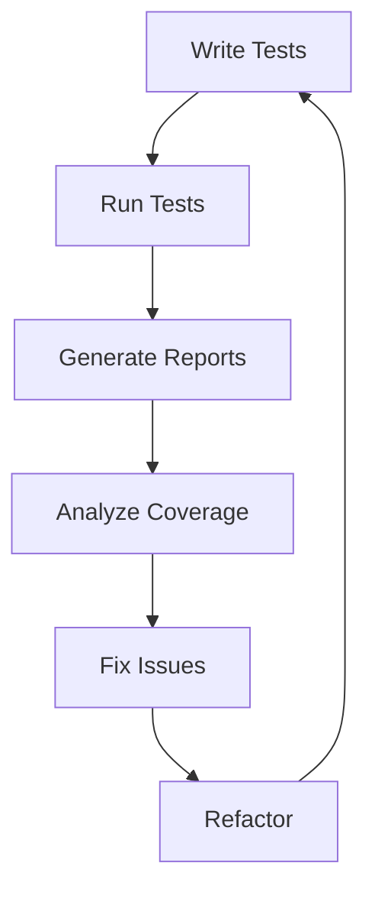
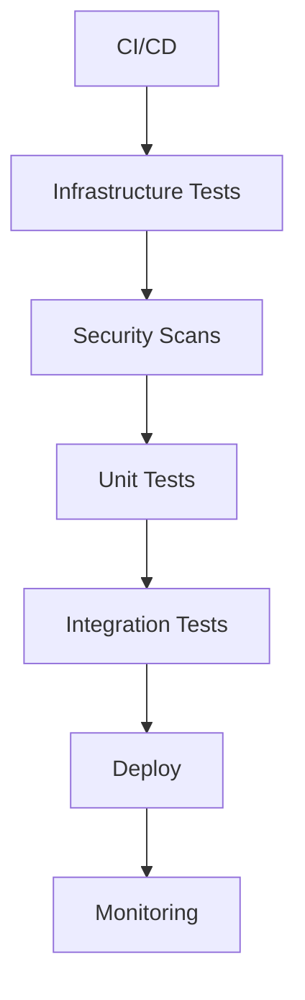

# Testing Frameworks Learning Resources

A comprehensive guide to test automation tools and testing frameworks. This repository provides structured learning paths, practical examples, and curated resources for testing practitioners at all levels.

## ⭐ Give a Star!
If you find this repository helpful or are using it to learn testing frameworks, please give it a star. Thanks!

## 📋 Table of Contents
- [Core Areas](#-core-areas)
  - [Infrastructure Testing](#infrastructure-testing)
  - [Unit Testing](#unit-testing)
  - [End-to-End Testing](#end-to-end-testing)
  - [API Testing](#api-testing)
  - [Performance Testing](#performance-testing)
  - [Testing Practices](#testing-practices)
- [How to Use This Repository](#-how-to-use-this-repository)
- [Project Ideas](#-project-ideas)
- [Learning Resources](#-learning-resources)
- [Contributing](#-contributing)
- [License](#-license)

## ⚠️ Disclaimer
> This repository aims to provide a structured learning path for testing frameworks and methodologies. The content is designed to guide you in understanding core concepts and practical implementation, rather than promoting specific tools or frameworks. Remember that testing practices evolve rapidly - always verify information and stay updated with the latest developments.

## 📊 Testing Diagrams

### Testing Pyramid

### Testing Tools

### Testing Workflow

### CI/CD Pipeline

## 📚 Core Areas

### Infrastructure Testing
- [Infrastructure Testing](./infrastructure/README.md)
  - Infrastructure as Code
    - Terraform Testing
    - CloudFormation Testing
    - Ansible Testing
  - Container Testing
    - Docker Testing
    - Kubernetes Testing
  - Security Testing
    - Infrastructure Security
    - Container Security
    - Secret Management
  - Compliance Testing
    - Compliance as Code
    - Policy Testing
  - CI/CD Pipeline Testing
    - Pipeline Validation
    - GitOps Testing
    - Deployment Testing

### Unit Testing
- [JavaScript Testing](./javascript/README.md)
  - Jest
    - Test Structure
    - Matchers
    - Mocking
    - Snapshot Testing
  - Mocha & Chai
    - Test Organization
    - Assertions
    - Hooks
    - Async Testing
  - Other Frameworks
    - Jasmine
    - AVA
    - Vitest

- [Python Testing](./python/README.md)
  - PyTest
    - Fixtures
    - Parametrization
    - Markers
    - Plugins
  - UnitTest
    - Test Cases
    - Assertions
    - Test Suites
    - Mock Objects
  - Advanced Tools
    - Nose
    - DocTest
    - Hypothesis

- [Java Testing](./java/README.md)
  - JUnit
    - Annotations
    - Assertions
    - Test Lifecycle
    - Parameterized Tests
  - TestNG
    - Configuration
    - Parallel Execution
    - Data Providers
    - Groups
  - Mocking
    - Mockito
    - PowerMock
    - EasyMock

### End-to-End Testing
- [Browser Testing](./e2e/browser/README.md)
  - Selenium
    - WebDriver
    - Page Objects
    - Wait Strategies
    - Grid
  - Cypress
    - Commands
    - Fixtures
    - Network Stubbing
    - Visual Testing
  - Modern Tools
    - Playwright
    - TestCafe
    - Puppeteer

- [Mobile Testing](./e2e/mobile/README.md)
  - Appium
    - Setup
    - Locators
    - Gestures
    - Cross-platform
  - Platform-Specific
    - XCTest (iOS)
    - Espresso (Android)
    - Detox
    - UI Automator

### API Testing
- [API Testing Tools](./api/README.md)
  - Postman
    - Collections
    - Environments
    - Newman
    - Monitors
  - REST Tools
    - REST Assured
    - Supertest
    - Karate
    - Pactum
  - Advanced Testing
    - Contract Testing
    - Performance Testing
    - Security Testing

### Performance Testing
- [Performance Tools](./performance/README.md)
  - JMeter
    - Test Plans
    - Thread Groups
    - Listeners
    - Distributed Testing
  - Modern Tools
    - K6
    - Artillery
    - Gatling
    - LoadRunner
  - Metrics
    - Response Time
    - Throughput
    - Error Rates
    - Resource Usage

### Testing Practices
- [Testing Methodologies](./practices/README.md)
  - Test-Driven Development (TDD)
    - Red-Green-Refactor
    - Best Practices
    - Common Patterns
  - Behavior-Driven Development (BDD)
    - Gherkin
    - Cucumber
    - SpecFlow
  - Testing Strategies
    - Integration Testing
    - Load Testing
    - Security Testing
    - Visual Testing

## 📚 Learning Resources

### YouTube Channels
- [Test Automation University](https://testautomationu.applitools.com/)
- [HashiCorp Learn](https://learn.hashicorp.com/)
- [AWS Testing](https://www.youtube.com/c/AWSDevOps)
- [DevSecOps University](https://www.devsecops.org/)
- [KodeKloud](https://www.youtube.com/c/KodeKloud)
- [TechWorld with Nana](https://www.youtube.com/c/TechWorldwithNana)
- [DevOps Toolkit](https://www.youtube.com/c/DevOpsToolkit)

### Blogs & Newsletters
- [HashiCorp Blog](https://www.hashicorp.com/blog)
- [AWS DevOps Blog](https://aws.amazon.com/blogs/devops/)
- [Google Cloud Blog](https://cloud.google.com/blog/topics/developers-practitioners)
- [DevSecOps Blog](https://www.devsecops.org/blog)
- [The New Stack](https://thenewstack.io/)
- [Container Journal](https://containerjournal.com/)
- [DevOps.com](https://devops.com/)

### Podcasts
- [DevOps Paradox](https://www.devopsparadox.com/)
- [The Pipeline](https://www.heavybit.com/library/podcasts/the-pipeline)
- [DevSecOps Podcast](https://www.devsecops.org/podcast)
- [The Secure Developer](https://www.heavybit.com/library/podcasts/the-secure-developer)
- [Cloud Security Podcast](https://cloudsecuritypodcast.tv/)
- [DevOps and Docker Talk](https://podcast.bretfisher.com/)

### Books
- "Infrastructure as Code"
- "The DevSecOps Handbook"
- "Cloud Native DevOps with Kubernetes"
- "Terraform: Up & Running"
- "Container Security"
- "The Phoenix Project"

### Testing Tools
- Infrastructure Testing
  - Terratest
  - Kitchen-Terraform
  - Molecule
  - Container Structure Tests
- Security Testing
  - tfsec
  - checkov
  - Trivy
  - OWASP ZAP
- Compliance Testing
  - InSpec
  - Open Policy Agent
  - Cloud Custodian
- CI/CD Tools
  - Jenkins
  - GitHub Actions
  - GitLab CI
  - ArgoCD

## 🚀 Project Ideas

### Infrastructure Projects
- IaC Test Suite
  - Terraform Modules Testing
  - CloudFormation Template Testing
  - Ansible Playbook Testing
- Container Security Suite
  - Docker Image Scanning
  - Kubernetes Security Testing
  - Registry Scanning
- Compliance Test Suite
  - CIS Benchmark Testing
  - SOC 2 Compliance Testing
  - HIPAA Compliance Testing

### Pipeline Projects
- GitOps Pipeline
  - Infrastructure Deployment
  - Security Scanning
  - Compliance Validation
- Multi-Cloud Testing
  - Cross-Cloud Deployment
  - Cloud-Agnostic Testing
  - Performance Benchmarking
- Security Pipeline
  - Secret Scanning
  - Vulnerability Testing
  - Compliance Checking

## 🤝 Contributing

Feel free to contribute by:
1. Adding new resources
2. Updating existing materials
3. Fixing errors or broken links
4. Improving documentation
5. Sharing project ideas

Please read our [Contributing Guidelines](CONTRIBUTING.md) before submitting a PR.

## 📝 License

This repository is licensed under the MIT License - see the [LICENSE](LICENSE) file for details.

## 👤 Author & Maintainer

This repository is maintained by [Donnivis Baker](https://github.com/dbsectrainer). For questions or feedback, please open an issue or reach out directly.

---
Last Updated: February 2025
